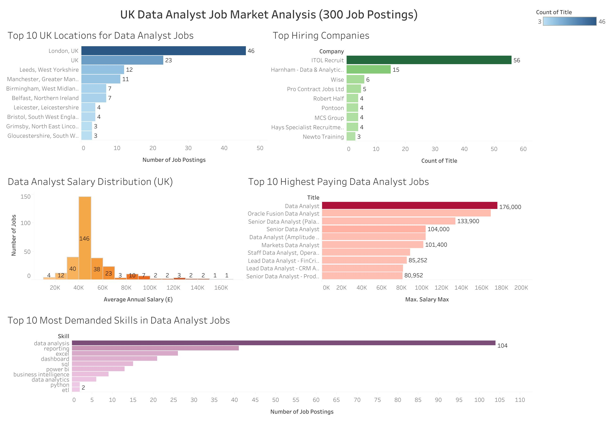

UK Job Market ETL Analysis

 Project Overview

This project develops an end-to-end ETL (Extract, Transform, Load) pipeline to analyze over 300 Data Analyst job postings in the United Kingdom. The pipeline extracts job market data from the Adzuna API, transforms and cleans the data using Python and Pandas, loads the processed data into a PostgreSQL database, and visualizes key insights through a Tableau dashboard.

The project aims to identify hiring trends, salary distributions, top hiring companies, high-demand locations, and the most sought-after skills in the UK Data Analyst job market.

---

 Technologies Used

 Python
 Pandas
 Requests
 PostgreSQL
 SQLAlchemy
 Apache Airflow
 Tableau Public
 Git & GitHub

---

 ETL Pipeline

 Extract

 Retrieved Data Analyst job listings from the Adzuna API.
 Collected job titles, company names, locations, salaries, descriptions, and skills.

 Transform

 Removed duplicate records.
 Cleaned and standardized job data.
 Processed skill-related information for analysis.
 Prepared datasets for reporting and visualization.

 Load

 Loaded the cleaned data into PostgreSQL.
 Created structured datasets for dashboard reporting and analysis.

---

 Apache Airflow Automation

Apache Airflow was integrated to automate and orchestrate the ETL workflow. A custom DAG (Directed Acyclic Graph) was developed to execute the pipeline on an hourly schedule.

 Workflow

Extract Jobs → Transform Jobs → Load Jobs

 Benefits

 Automated ETL execution
 Reduced manual intervention
 Scheduled hourly data updates
 Improved workflow monitoring and reliability
 Scalable pipeline orchestration

The Airflow DAG successfully executes all ETL stages and loads processed data into PostgreSQL for dashboard reporting.

---

 Project Structure

job-market-etl/
│
├── assets/
│   └── dashboard.jpeg
├── data/
├── scripts/
├── sql/
├── airflow/
│   └── job_market_etl.py
├── README.md
└── requirements.txt

---

 Dashboard Insights

The Tableau dashboard provides insights into:

 Top locations hiring Data Analysts in the UK
 Top hiring companies
 Salary distribution trends
 Highest-paying Data Analyst roles
 Most demanded technical skills

---

 Key Findings

 London has the highest demand for Data Analyst positions.
 ITOL Recruit is among the leading hiring companies in the dataset.
 Most advertised salaries range between £40,000 and £60,000.
 Several positions offer salaries exceeding £100,000.
 SQL remains one of the most in-demand skills for Data Analyst roles.
 The ETL pipeline successfully processed 300 job listings and loaded 296 cleaned records into PostgreSQL.
 Apache Airflow successfully automated the ETL workflow through hourly scheduled execution.

---

 Results

 300 job postings extracted from the Adzuna API.
 296 cleaned records loaded into PostgreSQL.
 Fully automated ETL pipeline using Apache Airflow.
 Interactive Tableau dashboard developed for business intelligence and reporting.

---

 Future Improvements

 Deploy the ETL pipeline and Airflow workflow to a cloud platform (AWS, Azure, or GCP).
 Integrate additional job market data sources.
 Implement real-time data streaming.
 Develop predictive salary and demand analytics models.
 Automate Tableau dashboard refreshes.

---

 Author

Natasha Menon
Master's Student – Business Analytics & Data Science
EU Business School

---

 Dashboard Preview

This dashboard visualizes job market trends identified through the ETL pipeline and supports data-driven insights into the UK Data Analyst job market.

 Key Dashboard Metrics

 Job demand by location
 Salary distribution analysis
 Top hiring companies
 Skills frequency analysis
 High-paying job opportunities

